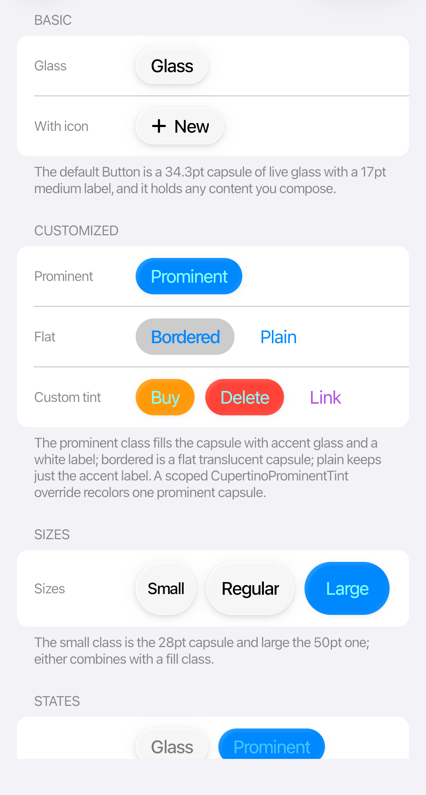
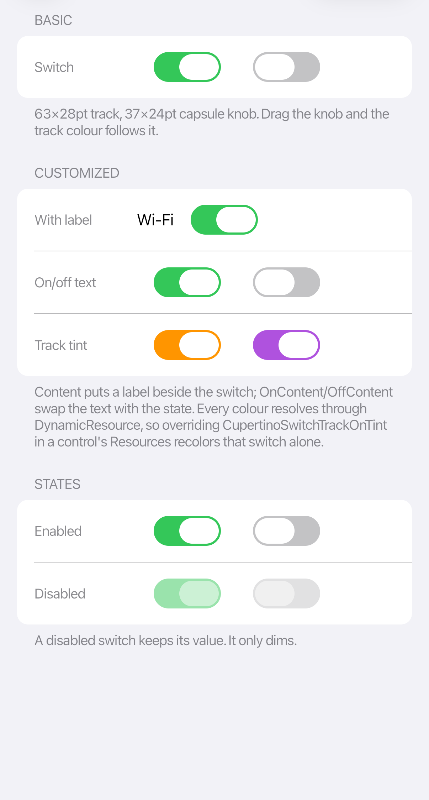

# Buttons and input

The theme restyles standard Avalonia controls, so bindings, commands, validation, and events work unchanged.

<table>
  <tr>
    <td></td>
    <td></td>
  </tr>
</table>

## Buttons

```xml
<StackPanel Orientation="Horizontal" Spacing="8">
  <Button Content="Cancel" Classes="plain" />
  <Button Content="Details" Classes="bordered" />
  <Button Content="Continue" Classes="prominent" />
</StackPanel>
```

Use `prominent` for the main action, `bordered` for secondary actions, and `plain` for less prominent actions. Add `small` or `large` to change the control size.

## Fields and selection

```xml
<StackPanel Spacing="12">
  <TextBox Text="{Binding Name}" PlaceholderText="Name" />
  <TextBox Classes="search" Text="{Binding Query}" PlaceholderText="Search" />
  <ComboBox ItemsSource="{Binding Qualities}"
            SelectedItem="{Binding Quality}" />
  <ToggleSwitch Content="Notifications"
                IsChecked="{Binding NotificationsEnabled}" />
  <Slider Minimum="0" Maximum="100" Value="{Binding Volume}" />
</StackPanel>
```

Keep related fields in a `Section` or `CupertinoFormRow`, and leave enough space around touch controls. A paired text field and stepper should use 8 pt spacing; paired date and time capsules use 4 pt.
