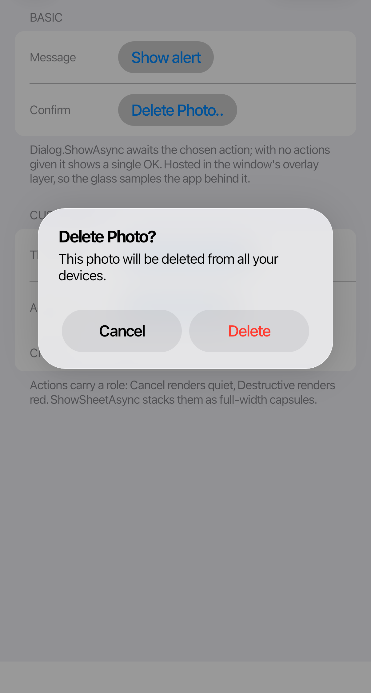
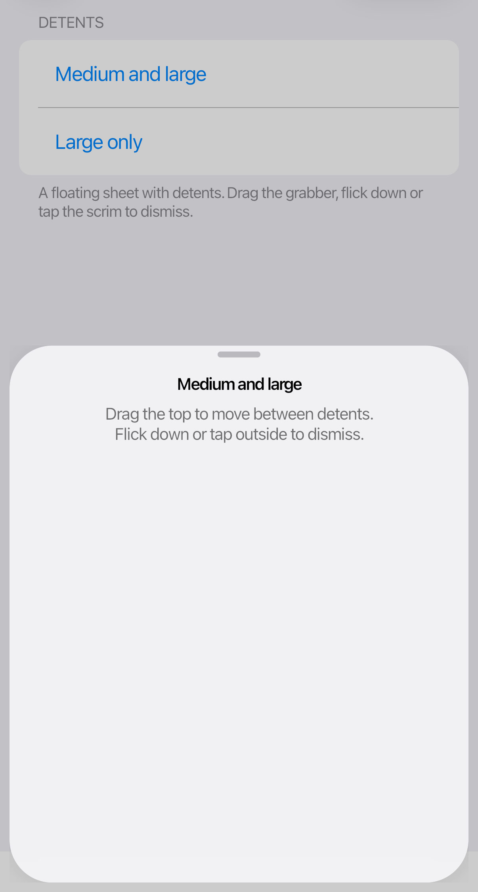

# Dialogs and sheets

<table>
  <tr>
    <td></td>
    <td></td>
  </tr>
</table>

## Dialogs

`Dialog.ShowAsync` returns the selected `DialogAction`. Each action's role controls its styling and initial focus.

```csharp
var result = await Dialog.ShowAsync(
    this,
    "Delete Photo?",
    "This photo will be deleted from all your devices.",
    new DialogAction("Cancel", DialogActionRole.Cancel),
    new DialogAction("Delete", DialogActionRole.Destructive));

if (result?.Role == DialogActionRole.Destructive)
    DeletePhoto();
```

Dialogs stack actions vertically when there are more than two. Use `ShowSheetAsync` to present an action sheet.

## Sheets

`CupertinoSheet` can show any Avalonia content. With `MediumAndLarge` detents, it opens at medium height and can expand. A large-only sheet opens near full height.

```csharp
await CupertinoSheet.ShowAsync(
    this,
    new DetailsView(),
    SheetDetents.MediumAndLarge);
```

Users can dismiss a sheet by dragging or flicking down, tapping the dimmed background, or pressing Escape. Tab and Shift+Tab keep focus inside the sheet; closing it restores the previous focus when possible.

Keep content clear of the grabber and check the layout at every enabled sheet height.
