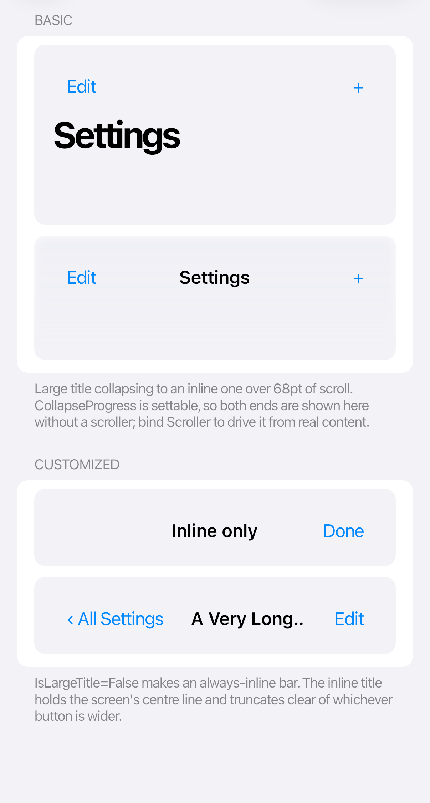

# Navigation

`CupertinoNavigationPage` owns a navigation stack, navigation bar transitions, and the edge-swipe back gesture.



```xml
<cupertino:CupertinoNavigationPage x:Name="Navigation"
                                   RootTitle="Library"
                                   RootContent="{Binding LibraryView}"
                                   IsBackGestureEnabled="True" />
```

Push and pop pages from code:

```csharp
Navigation.TryPush("details/42", "Details", new DetailsView());

if (Navigation.CanGoBack)
    Navigation.Pop();
```

Use stable route strings when saving navigation state. Subscribe to `Navigating` to cancel a transition, and to `NavigationCompleted` when work must occur after the animation finishes.

Navigation buttons and gestures follow right-to-left layouts automatically. Keep the same push and pop calls in both directions.

See <xref:Cupertino.Controls.CupertinoNavigationPage> for state restoration and route APIs.
