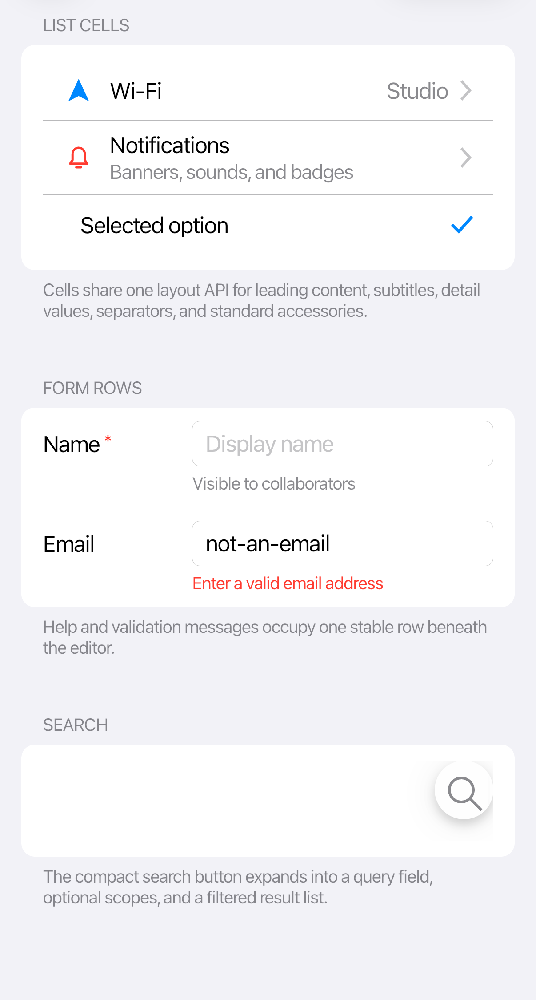

# Controls overview

The gallery groups controls by the job they do. Each control page shows the common case first, then customization and states that are easy to miss.

## Themed Avalonia controls

Use the standard Avalonia control when its semantics already match the problem. `CupertinoTheme` supplies the iOS presentation without changing the control API.

| Area | Examples |
| --- | --- |
| Actions | `Button`, `RepeatButton`, `HyperlinkButton`, `ToggleButton`, `SplitButton`, `DropDownButton` |
| Input | `TextBox`, `MaskedTextBox`, `NumericUpDown`, `ComboBox`, `AutoCompleteBox`, `CheckBox`, `RadioButton`, `ToggleSwitch`, `Slider` |
| Collections | `ListBox`, `TreeView`, `TabControl`, `TabStrip`, `Carousel` |
| Date and time | `Calendar`, `CalendarDatePicker`, `DatePicker`, `TimePicker` |
| Feedback | `ProgressBar`, `RefreshContainer`, `ToolTip`, `Expander` |
| Menus | `Menu`, `MenuFlyout`, `ContextMenu`, `Flyout` |

## Cupertino-specific controls

Use these when iOS provides an interaction or composition that Avalonia does not expose directly.

| Control | Use it for |
| --- | --- |
| `GlassSurface` | Live refractive material |
| `CupertinoNavigationPage` | Stack navigation and interactive back gestures |
| `CupertinoSheet` | Modal sheets with large or medium/large detents |
| `Dialog` | Alerts and action sheets with semantic action roles |
| `CupertinoSwipeView` | Leading and trailing row actions |
| `CupertinoDatePicker`, `CupertinoTimePicker`, `CupertinoDateTimePicker` | Compact and inline iOS pickers |
| `CupertinoCalendarView` | Inline month calendar |
| `CupertinoToolbar` | Bottom action groups separated by flexible spacers |
| `CupertinoBadge` | Counts and dot indicators |
| `CupertinoListCell`, `CupertinoFormRow`, `Section` | iOS list and form composition |
| `CupertinoSearchView` | Search field plus results composition |
| `CupertinoPageControl` | Page-position dots |
| `CupertinoIcon` | Original vector icons authored to iOS metrics |

For the complete property and event surface, use the [API reference](xref:Cupertino.Controls).
