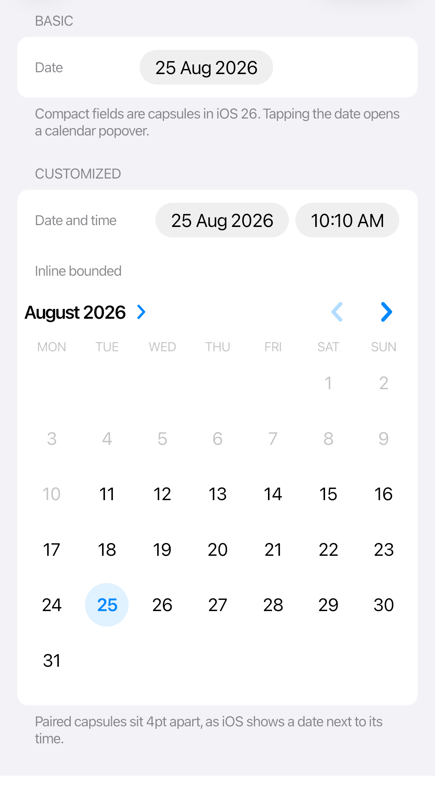
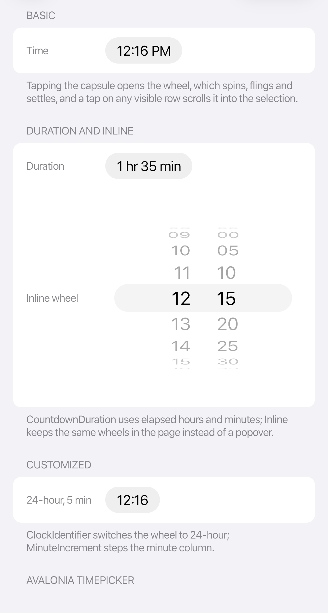

# Pickers and calendar

Cupertino pickers support compact capsule fields and inline content. Compact pickers open a calendar or wheel popover.

<table>
  <tr>
    <td></td>
    <td></td>
  </tr>
</table>

```xml
<StackPanel xmlns:cupertino="https://cupertino.avaloniaui.net" Spacing="12">
  <cupertino:CupertinoDatePicker SelectedDate="{Binding StartDate}"
                                 MinimumDate="{Binding EarliestDate}"
                                 MaximumDate="{Binding LatestDate}" />

  <cupertino:CupertinoTimePicker SelectedTime="{Binding StartTime}"
                                 MinuteIncrement="5" />

  <cupertino:CupertinoDateTimePicker SelectedDateTime="{Binding Appointment}" />
</StackPanel>
```

## Inline and duration modes

```xml
<StackPanel Spacing="16">
  <cupertino:CupertinoDatePicker DisplayMode="Inline"
                                 SelectedDate="{Binding Date}" />

  <cupertino:CupertinoTimePicker DisplayMode="Inline"
                                 Mode="CountdownDuration"
                                 SelectedTime="{Binding Duration}"
                                 MinuteIncrement="5" />
</StackPanel>
```

Set `ClockIdentifier` to `12HourClock` or `24HourClock` when the design must override the current culture. Otherwise, leave it unset and let the picker follow the user’s locale.

Use `CupertinoCalendarView` when the calendar is the primary content rather than a temporary picker surface.
