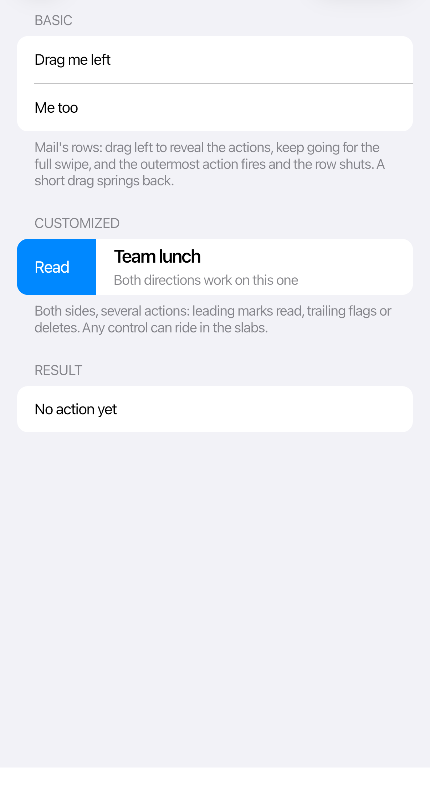

# Swipe actions

`CupertinoSwipeView` reveals actions as the user drags a row. A full swipe invokes the outermost action, matching the iOS list-row model.



```xml
<cupertino:CupertinoSwipeView x:Name="MessageRow" Height="52">
  <cupertino:CupertinoSwipeView.LeadingActions>
    <Button Classes="swipe"
            Content="Read"
            Background="{DynamicResource CupertinoAccentBrush}" />
  </cupertino:CupertinoSwipeView.LeadingActions>

  <cupertino:CupertinoSwipeView.TrailingActions>
    <StackPanel Orientation="Horizontal">
      <Button Classes="swipe"
              Content="Flag"
              Background="{DynamicResource CupertinoSystemOrangeBrush}" />
      <Button Classes="swipe swipe-destructive"
              Content="Delete" />
    </StackPanel>
  </cupertino:CupertinoSwipeView.TrailingActions>

  <cupertino:CupertinoListCell Title="Team lunch"
                              Subtitle="Tomorrow at noon" />
</cupertino:CupertinoSwipeView>
```

Only one row stays open at a time. You can also open or close its actions from code:

```csharp
MessageRow.OpenLeadingActions();
MessageRow.OpenTrailingActions();
MessageRow.Close();
```

Use short action labels. Put the action you want a full swipe to trigger at the outer edge.
