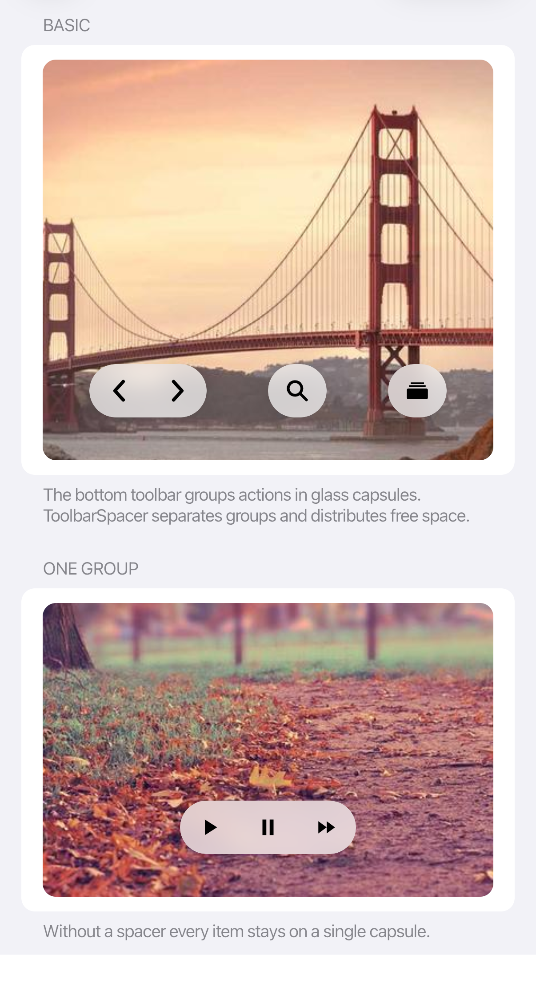
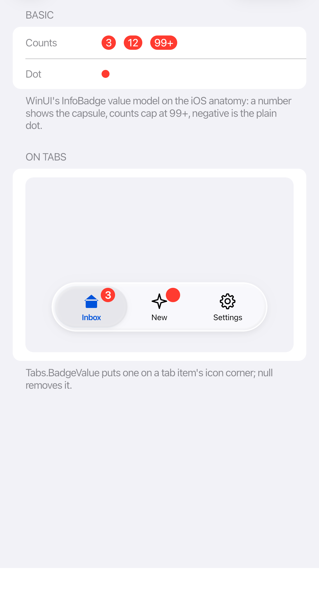

# Toolbars, tabs, and badges

<table>
  <tr>
    <td></td>
    <td></td>
    <td></td>
  </tr>
</table>

## Toolbars

Use toolbars for actions. Consecutive items share one glass capsule; `ToolbarSpacer` separates groups and fills the space between them.

```xml
<cupertino:CupertinoToolbar>
  <Button ToolTip.Tip="Back">
    <cupertino:CupertinoIcon Glyph="chevron.left" Size="20" />
  </Button>
  <Button ToolTip.Tip="Forward">
    <cupertino:CupertinoIcon Glyph="chevron.right" Size="20" />
  </Button>
  <cupertino:ToolbarSpacer />
  <Button ToolTip.Tip="Search">
    <cupertino:CupertinoIcon Glyph="magnifyingglass" Size="20" />
  </Button>
</cupertino:CupertinoToolbar>
```

## Tabs

Use the themed `TabControl` or `TabStrip` for navigation between sections. Use the `Tabs` attached properties to add a badge (`Tabs.BadgeValue`), a trailing accessory (`Tabs.Accessory`), or to detach an item into that accessory (`Tabs.IsDetached`).

Compact tab bars size themselves to their content. Let the theme size the tabs and selection indicator.

## Badges

Set `CupertinoBadge.Value` to a count. Values above 99 display `99+`; negative values display a dot. Use `Tabs.BadgeValue` to add a badge to a tab icon.

Give the associated control an accessible label that explains its destination or action, even when it has a badge.
