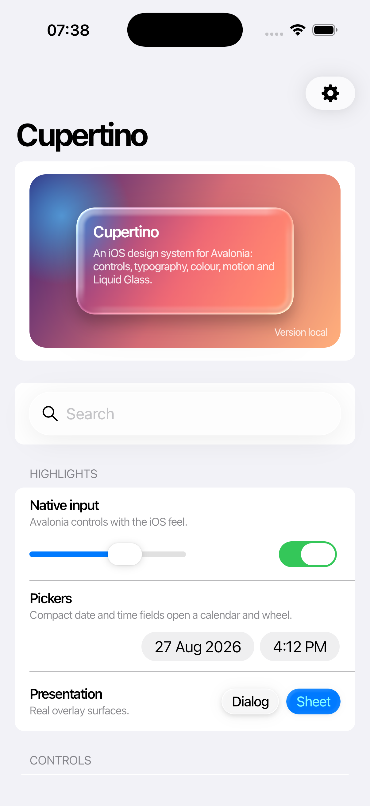

# Gallery

`samples/Cupertino.Gallery` lets you try the controls, compare their states and view the source for each example.



## Desktop

```bash
dotnet run --project samples/Cupertino.Gallery.Desktop
```

At 760 device-independent pixels and wider, the gallery keeps the catalogue on the left and opens samples on the right. Narrow windows use a single navigation stack with a back button. The same adaptive layout is used on every platform.

## Mobile

The mobile projects are:

- `samples/Cupertino.Gallery.iOS`
- `samples/Cupertino.Gallery.Android`

The iOS gallery includes a Side by Side page with native controls for comparison on the iOS 26.2 Simulator. Use the desktop and Android galleries to check pointer, keyboard and touch behavior on those platforms.

## WebAssembly

Install the WebAssembly tools once, then run the browser host:

```bash
dotnet workload install wasm-tools
dotnet run --project samples/Cupertino.Gallery.Browser
```

Publishing produces a static site at `samples/Cupertino.Gallery.Browser/bin/Release/net10.0-browser/publish/wwwroot`. The documentation workflow stores the gallery and project documentation together as a private Actions artifact.

The source for each gallery page lives in [`samples/Cupertino.Gallery/Pages`](https://github.com/jsuarezruiz/Cupertino.Avalonia/tree/main/samples/Cupertino.Gallery/Pages).
